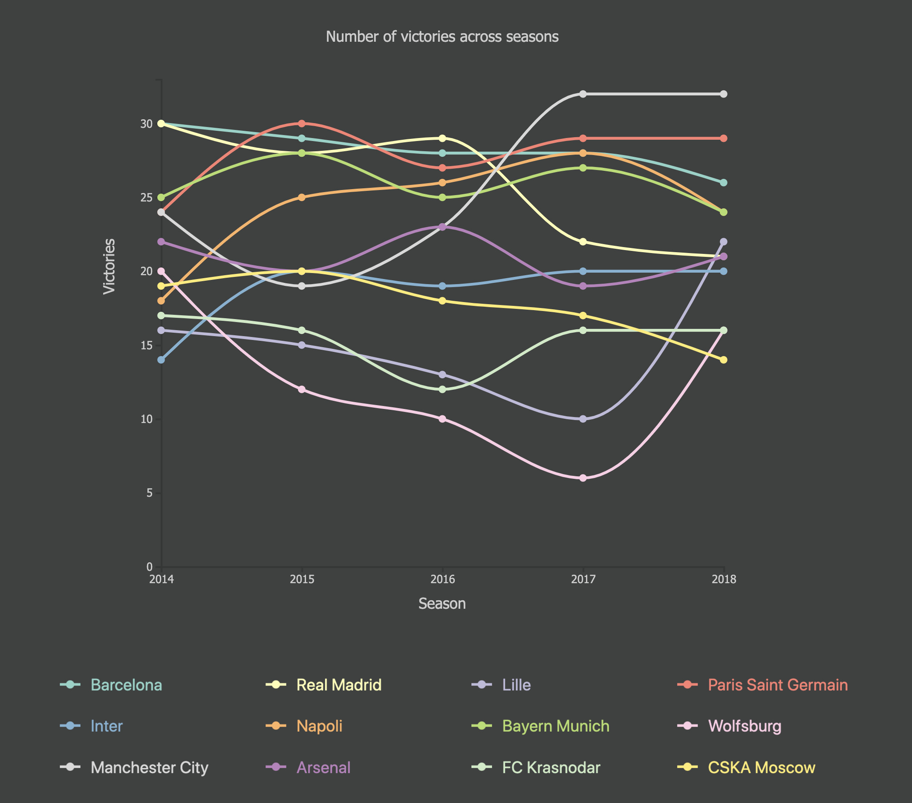
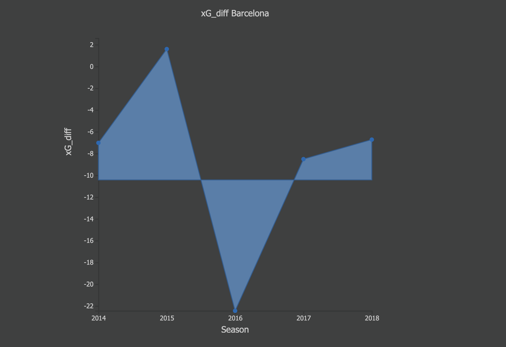
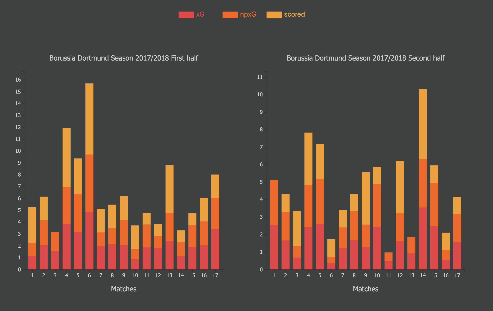
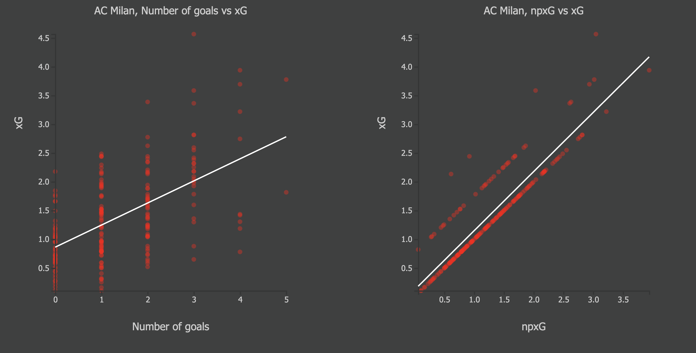

## Welcome to GitHub Pages

You can use the [editor on GitHub](https://github.com/KossaiSbai/sdv-kossai-sbai/edit/master/README.md) to maintain and preview the content for your website in Markdown files.

Whenever you commit to this repository, GitHub Pages will run [Jekyll](https://jekyllrb.com/) to rebuild the pages in your site, from the content in your Markdown files.

## Introduction
The purpose of this proposal is to provide a data visualisation that will give a better insight on European football, in particular be able to assess teams performances. In fact, football is a low- scoring sport: the overall average number of goals scored per game at the FIFA World Cups between 1930 and 2018, is 3.08. This shows us that we cannot evaluate a teams’ performance on the number of goals scored. It is important to be able to judge how well a team did on given games: it enables the club to improve team strategies and hopefully increase number of won games. 
Therefore, we can ask ourselves: what are appropriate metrics to use in order to get a reliable measure of the performance of a team? Can analysing the game style of a team help us explain why it might have done better/worse on a given season/game? 

The dataset [1] that will be used, in order to answer those questions contains statistical summary data by the end of each season from 2014 for 6 UEFA Leagues: La Liga, Ligue 1, EPL, Bundesliga, Serie A and RFPL. It is made up of two CSV files: the first one displays summary data per season for all the teams whereas the second one displays similar data per game for all the teams. 

## Litterature review 
Researchers in the football statistics field have been coming up with different parameters in order to evaluate teams and players performance. For instance, historical-based approaches use past victories, defeats to both assess a team and predict future performance. One drawback of this approach is that teams change over time : incoming and outcoming transfers change the team’s roster and the given club might get different coaches to manage the team, who will most likely adopt different strategies in the games.

The “expected goals” (xG) metric along with others of them will be used in this visualisation, as as parameters assessing a team’s performance . 
However what is xG metric? 
xG tells us how likely it is that a shot would have  resulted in a goal. 
Sam Green wrote about the “expected goals” metric (xG) in [2]. In there, using OptaPro data collection, he came up with a model that aims to determine "a shot’s probability of being on target and/or scored.” He also states that not only this metric can be useful for offensive perspective but
also enables us to defend “key areas of the pitch” and eventually concede less goals. 
Finally, Rathke Alex in [3], uses an Xg model taking other parameters such as, distance of the shot from the goal,  to investigate about goal scoring in PL and Bundesliga 2012-2013 season, in particular assessing strikers’ performances. He concludes by stressing the reliability of this metric: he states that “could be incorporated into training exercises (attacking and defensive) to aid player’s understanding and needs of the game”.

## Interactive visualizations
The proposed website contains 5 visualizations. 
- Table


- Line chart 





- Area chart


 


- Stacked bar chart


  


- Scatter plot


  


## Main results

The main results found are the following: 

In the area chart, the xG_diff (expected goals difference) is plotted across seasons.  This metric denotes the difference between the predicted number of goals and the actual number of goals scored. Hence mathematically xG_diff = xG - scored. So, if the difference is negative then this means that the team has scored more goals than expected otherwise it is the opposite behaviour.  
The average xG_diff over the dataset (23337 entries) equals -0.031913455609787665. 
On the one hand , top ranked teams in table tend to have an overall negative xG_diff value : they overall  score more than expected, which indeed makes sense and is explained by the quality of the team and reflects a good performance from the team. 
On the other hand, the opposite logic applies to lower ranked teams. 

xG vs npxG: when observing the value of those two variables for each match of a given season for a given team, average difference of 0.11394721622814627.  Result makes sense since penalties and own goals do not occur that often. Hence, not taking into account those match events does not seem to affect the goal probability a lot. 

The scatter plot highlights the relationship between two pairs of metrics: (xG,goals) and (npxG/xG). After analysis of the obtained results, it can be deduced that the correlation between those variables is moderate positive linear. In fact, as mentioned earlier the npxG barely varies relatively to the xG. Moreover, even if a given team might underperform or overperform in terms of number of goals, the scatter plot shows that the xG predicts pretty accurately: it can be seen by the fact that on each tick of the x-axis, the majority of the data points are focused around the equivalent value on the y-axis. Above example, for example when we look at all data points with an abscissa of 1, many ot those points have an ordinate around 1 as well (between 0.5 and 1.5). This indeed concords with the low average xG_diff result mentioned earlier. 


## Evaluation

Interesting findings: the following result was expected: the xG gives a pretty accurate prediction of the perofmrnace of a team on a match/season in terms of goals scored and implicitly o=in terms of overall wins/loses. The revealed results confirm this: even if a team might end up scoring more or less than xG, overall xG is fairly close the the number of goals the team scored on the day. The xG seems to reflect well the level difference between teams. 
Strengths: the visualisations clearly highlight the positive correlation between the metrics and therefore the difference in performance between teams. 
Limitation of the approach: focused essentially on xG and npXG (expected goals related metrics). There are other metrics which can be brought and be combined to give a more accurate estimate of the performance of a team. 
We do not really know what model was used to calculate the xG. Hence we do not know how reliable is. 

## Conclusions

What I would do differently: try to use more complex visualisations. On bar chart analyse season by season performance instead of match by match. Might give a different insight since we change the timescale.
What could be done further: analyse other metrics with number of goals/wins as well as the metrics between themselves. So for example: xG vs deep or xG vs xGa or ppda coefficient vs deep. Essentially bring in more pairs of metrics. 

```markdown
Syntax highlighted code block

# Header 1
## Header 2
### Header 3

- Bulleted
- List

1. Numbered
2. List

**Bold** and _Italic_ and `Code` text

[Link](url) and 
```

For more details see [GitHub Flavored Markdown](https://guides.github.com/features/mastering-markdown/).

### Jekyll Themes

Your Pages site will use the layout and styles from the Jekyll theme you have selected in your [repository settings](https://github.com/KossaiSbai/sdv-kossai-sbai/settings). The name of this theme is saved in the Jekyll `_config.yml` configuration file.

### Support or Contact

Having trouble with Pages? Check out our [documentation](https://help.github.com/categories/github-pages-basics/) or [contact support](https://github.com/contact) and we’ll help you sort it out.
